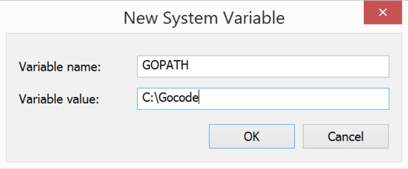

# 欢迎新的Gopher

本章的目的是为了让您从宏观方面了解Go的基础知识。首先在我们学习Go的**工具链**、**语法**和**类型**系统之前，我们将起始于在不同操作系统平台下安装Go，并写下第一份Go代码。让我们开始吧。

## 安装

写Go代码的第一步就是着手安装Go语言，你可以访问[https://golang.org/doc/install](https://golang.org/doc/install)。Go的开发者为Windows，Mac OS和Linunx都提供了安装包。当然，如果您的系统并提供安装程序，您也可以使用go的源码安装。

一旦安装完毕go之后，在命令行下输入`go version`，终端将会打印所安装的go的版本。如果发生错误，重启命令行重新输入，否则可能需要像go的[官网](https://golang.org/)报告错误并寻求解决办法。

> Go的别名golang
> 
> Go 的官网是 [golang.org]（https://golang.org/），语言的全面其实是“golang”。当您使用“Go”关键字搜索的时候找不到解决问题有效的办法，可以尝试搜索关键字“Golang”。他们两者本质上是等价的


### Go工作区（Workspace）

通过本书，你将会感知到Go是一门强制选择配置的语言，你必须按照Go的方式构建工作区和组织代码。其他语言你可以根据自己下喜好任意组织代码，Go则希望你使用Go的方式，将你的所有项目源码存放一个特殊路径`GOPATH`的文件夹中。这样做的好处是你可以轻松的是用go工具下载和管理第三方（third-party）包源码，如果不这样做，除了标准库之外，你将无法使用任何第三方包。

这很可能与你熟悉的工作方式不同，请尽量尝试改变吧。起初我也很反感，后来尝试学习并接受Go的方式（Go way），如今已经习惯这样的代码管理方式。

`GOPATH`路径中可以有多个子文件夹，最重要的一个莫过于`src`文件夹。src文件夹存放你写的go代码和go的第三方包源码。现在创建一个文件命名为`src`。当你开始写go代码的时候，请将这些代码保存在src文件夹中。为了告诉Go哪一个文件夹为`GOPATH`路径，我们需要设置一个同名的环境变量（environment variables）。如果你对环境变量不熟，下面将会逐一接受在在Windows，Mac OS, Linux不同系统中的配置。

#### Mac OS 和 Linux

每当命令行窗口启动的时候，都会加载一个`bash profile`的文件，
在Mac OS 和 Linux中设置环境变量，只需要往这个bash中添加即可：

```
echo "export GOPATH=~/Gocode" >> ~/.bash_profile
source ~/.bash_profile
```
上述的代码将会指定你的`GOPATH`环境变量为在你的家（home）目录下的`Gocode`文件夹。然后重新载bash_profile文件以激活配置。

> 不同shell
> 
> 如果你不使用bash，上述的代码可能会失效。比如安装了别的shell例如zsh，你可以google查询zsh的配置方式。如果是你自己写的shell，想必你也指定如何设置啦


#### Windows

Windows8中设置环境变量，只需要在**桌面**左下角右键，选择**系统**->**高级系统设置**->，然后选择**高级**选项卡（tab），然后是**环境变量**按钮。如下图1.1

Windows7, Windows Vista, 右键桌面**计算机**图标或者开始菜单。选择**属性**然后选择**高级系统设置**，然后是**高级**选项卡，最后是**环境变量**按钮。


一旦打开了环境变量设置窗口，选择在**系统变量**中选择**新建**，然后创建一个新的变量命名为`GOPATH`，变量的值为你的go代码工作区的路径，如下图，我设置`C:\Gocode`为`GOPATH`。



### 第一份Go代码

本章将会介绍一些基本的go语法，以及使用go写代码的一些常用工具。该介绍只涉及一些基础的知识，而不是全面的go语言教程。随着我们逐步贯穿此书，会逐渐介绍所遇到的概念知识。

任何一门编程的书都会起始于“Hello World”例子，因此让我们跟随巨人的脚步，开启go编程第一步。创建一个文件---`helloworld.go`，然后键入如下代码：

helloworld.go

```
package main
import "fmt"
func main() {
    fmt.Println("Hello World")
}
```

然后使用命令行打开hellowworld.go所在的目录，运行代码：

```
go run helloworld.go
```

运行成功就会在命令行打印输出`Hello World`。麻雀虽小，五脏俱全，这个简单的程序宝贝了go程序的基本结构。代码开头，我们声明了代码所属的包（package）名。包是我们组织代码的基础结构，`main`包则是特殊的包，它可以直接执行。如果想要写一个包在别的Go程序中使用，必须指定一个唯一的main package。后面的章节将会介绍如何写我们自己的包。

开头的下一行，我们导入（import）了程序所使用的包。因为这是一个简单程序，我们只应引用了一个包：`fmt`。`fmt`包来自Go标准库，后者随着go语言安装的时候一起安装。它提供了基本的格式化输出打印操作。`fmt`是标准库的一部分，是一个基础的导入语句。随后，我们将会见识到go如何通过源码url导入第三方包的导入语句；例如：“import github.com/tools/godep”。

最后，我们定义了一个`main`函数，函数中使用了`fmt`包的`Println`函数。main函数是go程序的入口点，当程序启动的时候会执行main函数。`Println`将会打印传入变量的值，你可以传入任何变量。

至此，你可能注意到了go语法的一些字符。首先，括号和花括号和类C的语言很像。不过，你会发现每一句代码结束时并没有分号，每一句结束的下一行为新的语句的开始。最后你会发现代码编译和运行的时间都很快。这是go团队早期的决策之一，让go牺牲一些性能一遍确保提升代码编译速度，这让go在开发程序的时候更有乐趣。

## Go 工具

我们已经见识了第一个go工具（tools）的例子。我们使用go命令行工具运行`.go`文件。`go run`将会编译并运行代码。如果想要创建可执行文件取代每次run文件，可是使用命令`go build`。该命令将会编译当前文件夹下的所有文件，并创建一个以当前文件夹命名的可行性的二进制文件。例如，`chapter1`文件下创建了`helloworld.go`文件，运行`go build`，将会得到一个名为`chapter1`的可行性文件。进一步可以使用`go install`命令，该命令会把编译生成的二进制文件移动到`$GOPATH/bin`文件夹内。如果该文件夹在系统的`PATH`环境变量内，你就可以在任何路径下执行运行这个编译后的go程序。

> PATH 环境变量
> 
> PATH 环境变量是系统寻找可行性文件的路径。当你在命令行输入某个命令的时候，系统会在PATH目录下寻找命令，并执行所找到的第一个命令，如果找不到就会报错。在windows中，你也可以设置PATH包含GOPATH。在MacOS 和Linxu中可以使用早先介方式添加： `export PATH=$PATH:$GOPATH/bin`追加到你的bash profile文件中。

## 基本类型（Types）
Go是一门**强类型**语言。这意味着任何变量止只能存储单一类型的值，当然有时候你需要在不同类型之间进行转换。一旦变量声明后，该变量只能赋值所声明的类型。Go提供了丰富的基础类型，通过这些基础类型，你可以轻松的创建自定义类型来扩展基础类型。

### 字串（String）

**字串**是最普遍的基础类型之一。下面创建一个新的变量，并声明赋值为字串：

```
myString := "I'am a string."
```

注意，我们使用冒号（:）和等号（=）的方式，将一个字串赋值给变量**myString**。`:=`该符号可以声明并初始化一个新的变量。如果你想要修改已经声明初始化**myString**变量的值，重新赋值的时候需要删除冒号。如果仍然保留冒号，等于再次声明一个变量，将导致编译失败：

```
myString := "I’m a string."
myString = "I’m really a string, I promise."
```

尝试重新声明初始化变量，编译代码的时候将会收到“`:=`左边没有性的变量”的错误提示。

可以使用`+`符号连接字串。

```
myString := "I’m a string."
myOtherString := myString + " I really am."
fmt.Println(myOtherString) // 输出 "I’m a string. I really am."
```

> Go注释
> 
> Go支持单行和多行注释，`//`用于单行注释，多行注释的首尾巴使用`/*`和`*/`包裹

### 数字（Number）

Go有很多表示数字的类型。我们归纳为有两大类别：整型（integer）和浮点型(float)。所有不包含小数部分的数字都是**整型**，如`1`， `-7`，和`42`。浮点型则包含小数部分的数字，例如`3.141`或者`-9.2`。

#### 整型（Integer）

每一类数字，都有若干类型。整型有最多的类型：`int`, `int8`, `int16`, `int32`, `int64`, `uint`, `uint8`, `uint16`, `uint32`, 和`uint64`。每一个类型所存储的数字大小是不一样的，主要是基于他们的内存容量是8位（bit）还是16位或32位，64位。例如`int8`可以存储 -128到127之间的数字。而int64可以存储- 9223372036854775808到9223372036854775807之间的数字。任何以`int`开头的整型都是无符号类型，即可以存储正数也可以存储负数，而以`uint`开头的则是无符号类型，只能表示正整数。

事先知道变量的数值的范围可以选择声明合适的变量类型，以减少内存消耗。可是，你会发现通常你都会使用`int64`或者`int`类型。

> 特殊的int
> 
> int是特殊的整型，它的存储范围依赖于计算机的架构。通常你将会使用64位的架构，那么`int`和`int64`是等价的。同理对于`uint`也适用。


#### 浮点型（Float）

浮点型只有两种，`float32`和`float64`。`float64`比`float32`更适用，例如处理很多小数部分的时候。

不同类型之间是不能直接运算操作的。否则将会得到一个编译错误“nvalid operation: a * b (mismatched types int and float64).”即无效的操作，a是int类型，b是float64类型，两者不能相加。想要相加，必须通过强制类型转换：

```
myInt := 2
myFloat := 1.5
myOtherFloat := float64(myInt) * myFloat
fmt.Println(myOtherFloat) // 输出 3
```

> 类型转换
> 
> 别的语言通常使用一种叫“casting”的类型转换手段。需要转换的变量前面用一对圆括号包裹将要转换的的目标类型。这种处理只适用于同一种类别的类型转换，比如都是数字类型。不同类型之间的转换会产生编译错误。后面我们将会介绍更多关于类型转换的例子。

### 布尔（Boolean）

**布尔** 类型相当于预先定义的两个常量：`true`或者`false`。在条件判断中，它们扮演了重要角色，除此之外没有什么可说的。

```
myBool := true
if myBool {
    fmt.Println("myBool is true")
} else {
    fmt.Println("myBool isn’t true")
}
```


### 数组（Aarry）和切片（Slice）


#### 循环
### 图（Map）
#### 图的循环
#### 图的处理

## 函数（Function）
### 指针（Pointer）

## 结构（Struct）
### 方法（Method）
## 代码可导性
## 总结


